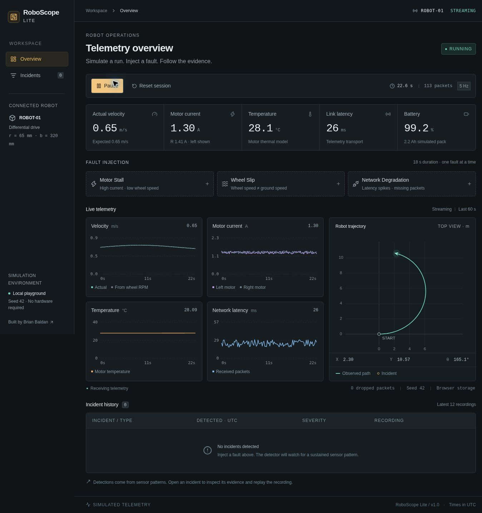
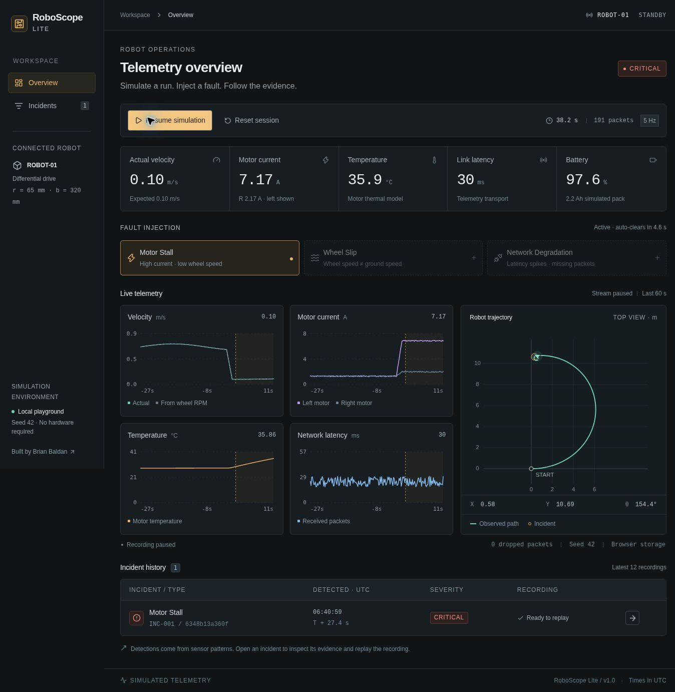
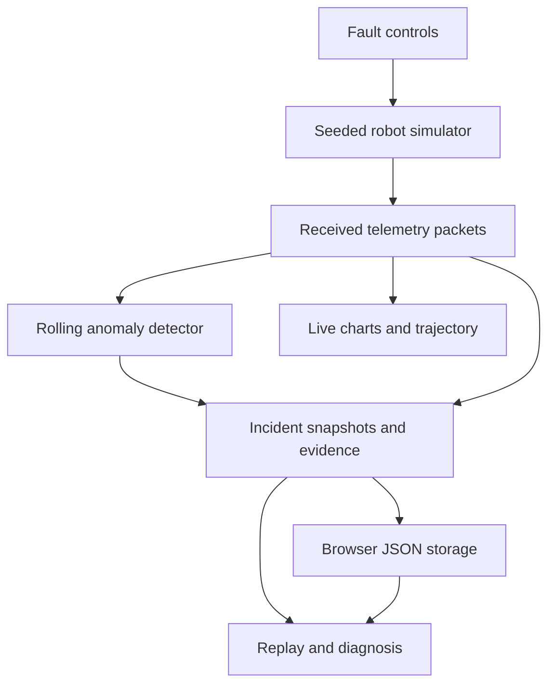

# RoboScope Lite

**Replay robot failures. Understand what went wrong.**



RoboScope Lite is an open-source robot telemetry and incident analysis playground. It simulates robot motion and sensor readings, detects failures from their measured patterns, and lets developers replay incidents to understand what went wrong.

Built by **Moch. Brian Mursyidan Baldan**, Robotics and Artificial Intelligence Engineering, Universitas Airlangga.

## Live Demo

The application is ready to run locally. A verified public deployment is not available yet. See [Deployment](#deployment) for the Vercel setup.

## What It Does

- Simulates one differential-drive robot at 5 Hz with seeded, reproducible sensor noise.
- Injects **motor stall**, **wheel slip**, and **network degradation** into the simulator.
- Detects sustained anomalies from received telemetry, independently of the fault controls.
- Records incidents with original samples, sensor timestamps, and before/after evidence.
- Replays up to 30 seconds before detection and 10 seconds after it at 0.5×, 1×, or 2×.
- Synchronizes the chart cursors, metrics, and robot position during replay.
- Keeps the current session and the latest 12 incidents in browser storage.

There is no account setup, backend database, API key, or external AI service.

## Demo

1. Click **Start simulation** and watch the robot move.
2. Wait at least 5 seconds for a baseline. Wait 35 seconds to get a complete 30-second pre-event replay window.
3. Click **Motor Stall**. Current rises, wheel rotation slows, and the detector creates a critical incident after the abnormal pattern persists.
4. Let the simulation run for another 13–15 seconds so the 10-second post-detection window can finish recording.
5. Open the incident from **Incident history**.
6. Click **Replay incident**. Try the speed selector, drag the time slider, and use **Jump to detection**.
7. Read **Signal evidence**, **Likely cause**, and the timeline. Each numeric comparison comes from received sensor samples.
8. Return to the overview and try the other faults. A fault clears automatically after 18 simulated seconds. **Reset session** starts a fresh run and retains the incident archive.



## Architecture



The simulator, detector, and incident engine are pure TypeScript functions. React owns the session clock and renders their output. Next.js supplies routing and the application shell; all simulation and recording work happens in the browser. Persistence is versioned JSON in `localStorage`, avoiding filesystem writes that would be lost between serverless requests on Vercel.

The detector never reads `sim.fault`. Tests replay the same observed packets into a fresh detector with no injection metadata and expect the same incident type.

## Fault Scenarios

| Fault | Simulator behavior | Observable evidence |
| --- | --- | --- |
| Motor Stall | Left wheel rotation falls by up to 96%; the right wheel slows as a simplified coupled-drive response; left current increases | High left current, low RPM and ground speed, gradually rising temperature |
| Wheel Slip | Encoders keep turning, but unequal wheel contact factors reduce translation and change yaw | RPM-derived velocity exceeds actual velocity; the path deviates |
| Network Degradation | Latency increases and the seeded transport drops approximately 32% of packets after ramp-up | Latency spikes, sequence-number gaps, gaps in chart paths |

Each fault lasts **18 simulated seconds**, with a **1.6-second ramp**. Only one injected fault is active at a time. Faults are deterministic for the same seed and injection tick.

### Motion and sensor model

Wheel radius is 0.065 m, track width is 0.32 m, and encoders have 360 ticks per revolution.

```math
v_L = \frac{2\pi r\,\mathrm{RPM}_L}{60}, \qquad v_R = \frac{2\pi r\,\mathrm{RPM}_R}{60}
```

```math
v = \frac{v_L+v_R}{2}, \qquad \omega = \frac{v_R-v_L}{b}
```

Position is integrated at a fixed 0.2 s step using the midpoint heading. Slip applies separate contact factors to wheel surface speeds before integrating motion; encoders retain shaft rotation. Temperature integrates a simple current-squared heating term and ambient cooling. Battery percentage integrates motor current against a 2.2 Ah capacity. These are illustrative physical relationships, not a calibrated digital twin.

The telemetry schema includes `timestamp`, `elapsed`, `sequence`, `x`, `y`, `heading`, linear/angular velocity, both wheel RPMs, both motor currents, motor temperature, battery, both encoder counts, and network latency. Units are milliseconds, seconds, meters, radians, m/s, rad/s, rpm, amperes, °C, percent, and encoder ticks. Timestamp values use UTC.

## Detection Logic

The following conditions use a **1-second rolling mean** with at least three received samples. A condition must persist for **at least 0.8 seconds** before an incident is created. Sustained recovery for **2 seconds** rearms the detector and prevents duplicate incidents during one fault.

| Type | Rule | Severity |
| --- | --- | --- |
| Motor Stall | Left current > 4.5 A **and** actual velocity < 0.24 m/s **and** left wheel < 25 rpm | Critical |
| Wheel Slip | RPM-derived expected speed > 0.35 m/s **and** expected/actual discrepancy > 40% **and** left current < 4.5 A | Warning |
| Network Degradation | Observed latency > 200 ms; sequence gaps provide supporting evidence | Warning |

Diagnosis is deterministic **rule-based incident analysis**, not an LLM or a trained machine-learning model. An incident's `startTime` is the first sustained rule match, not the injection time. Its comparison baseline is a real received sample six seconds before that match, or the earliest available sample. The text describes a likely cause and inspection suggestions; it does not establish a hardware root cause.

## Tech Stack

- Next.js App Router, React, TypeScript
- Tailwind CSS and an application-specific stylesheet
- SVG telemetry plots and coordinate trajectory
- Browser `localStorage` for bounded, versioned recordings
- Node.js built-in test runner
- GitHub Actions workflow for tests and production build

## Quick Start

Use **Node.js 24 LTS** and npm. Extract or clone the repository, then run:

```bash
npm ci
npm run dev
```

Open the localhost URL printed by Next.js, normally `http://localhost:3000`.

On Windows PowerShell, use `npm.cmd` when PowerShell blocks `npm.ps1`:

```powershell
npm.cmd ci
npm.cmd run dev
```

Production mode:

```bash
npm run build
npm start
```

No environment variables are required. The small `scripts/dev.mjs` adapter accepts both Next.js and preview-supervisor host flags; the application still runs on Next.js.

## Project Structure

| Path | Responsibility |
| --- | --- |
| `src/lib/simulator.ts` | Seeded motion, sensors, and packet loss |
| `src/lib/detector.ts` | Rolling conditions, debouncing, incident evidence |
| `src/lib/session.ts` | Session advancement, recording, and retention |
| `src/lib/analysis.ts` | Diagnosis text, packet-gap counts, and time labels |
| `src/lib/storage.ts` | Version and shape validation for saved JSON |
| `src/components/session-provider.tsx` | Clock, persistence, simulation controls |
| `src/components/visuals.tsx` | Metrics, chart lines/cursors, and trajectory |
| `src/components/dashboard.tsx` | Live overview, fault injection, incident history |
| `src/components/incident-detail.tsx` | Replay controls, evidence, and timeline |
| `src/app/incidents/[id]/page.tsx` | Dynamic incident route |
| `tests/pipeline.test.ts` | Behavioral tests for the full pipeline |
| `docs/screenshots/` | Actual screenshots captured during browser QA |

## Testing

```bash
npm test
npm run typecheck
npm run build
```

The tests cover physical relationships, deterministic output, all three fault signatures, detection without fault metadata, false-positive resistance, recovery/rearming, original-sample evidence, replay window bounds, persistence validation, archive preservation, retention, and session limits. See [QA notes](docs/QA.md) for browser checks and delivery status.

## Deployment

1. Push the project to a GitHub repository named `roboscope-lite`.
2. Import that repository into Vercel. Choose the **Next.js** preset and Node.js **24.x**.
3. Use the repository root, `npm ci` for install, and `npm run build` for build. Leave the output directory at its Next.js default.
4. No database or environment secrets are needed.
5. After deployment, open the production URL and repeat the Demo workflow, including refresh and incident replay. Only then add the verified URL to this README.

Repository description: `Replay robot failures and understand what went wrong — an interactive robot telemetry and incident analysis playground.`

Suggested topics: `robotics`, `robotics-simulation`, `telemetry`, `anomaly-detection`, `observability`, `nextjs`, `typescript`, `developer-tools`.

## Limitations

- This is a single-robot educational simulation, not a hardware controller or safety system.
- Actual ground velocity is simulator truth. A real robot would need an independent measurement to distinguish slip from encoder motion.
- Network latency is a simulated field; packets are dropped, but transport is not queued or reordered by their latency value. Total loss of all packets does not trigger the packet-driven latency detector.
- Sessions stop after 10 simulated minutes; the latest 12 incidents are retained. A reset preserves incidents but ends incomplete post-event captures from the previous session.
- Replay includes only available history. Early faults have less than 30 seconds of pre-event data. Pause/closing/resetting may leave the post-event window incomplete, which is labeled in the UI.
- Replay holds the last received state across telemetry gaps; charts leave gaps rather than inventing samples.
- Recordings stay in one browser and origin. Private browsing, clearing site data, or changing deployment domains can lose access. Links to incidents do not transfer their recordings to another device.
- Use one active tab per origin. Concurrent tabs can overwrite the shared recording. Browser timer throttling can slow simulated time in background tabs.
- Persistence runs once per second and when pausing or leaving the page. Abrupt browser/process termination can lose the most recent samples. Storage failures display an in-memory fallback warning.
- Detector thresholds are hand-selected for these scenarios. They are not validated against real robot datasets.

## Roadmap

The core demo is intentionally small. Possible future work: export/import a recording, calibrate against measured motor data, and add an explicit no-packet timeout detector. These are not implemented features.

## License

[MIT](LICENSE)
